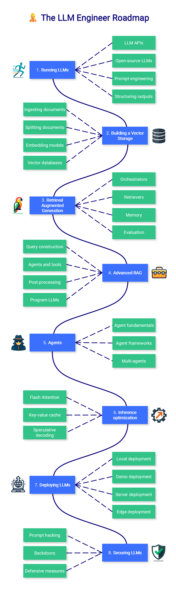
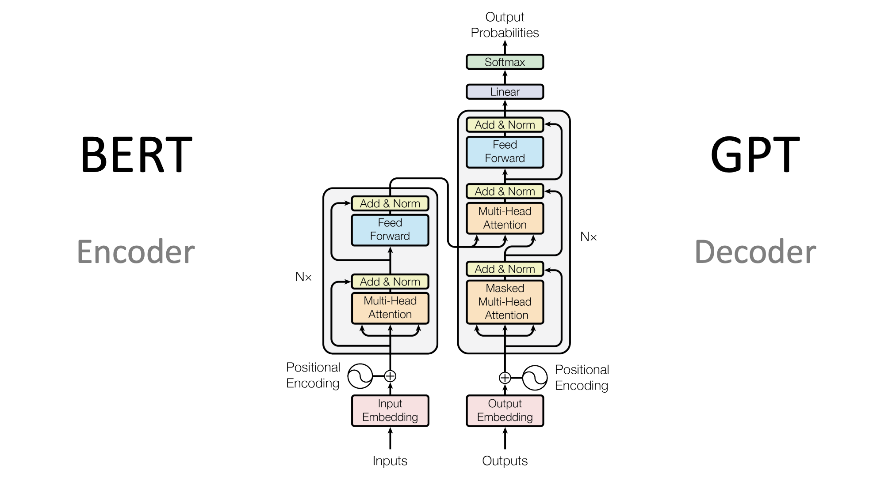
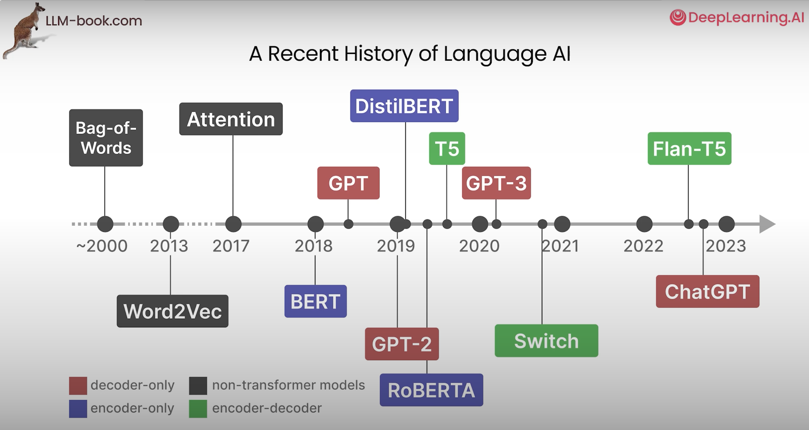

# Day 1
## LLM Scientist roadmap 

1. LLM Architecture --> Architectural overview, Tokenization, Attention Mechanisms, Sampling Techniques
2. Pre Training Models --> Data Preparation, Distribute Training, Training Optimisation, Monitoring
3. Post Training Models --> Storage & Chat templates, Synthetic Data genration, Data enhancement, Quality filtering
4. Supervised Fine tuning  --> Training technique, Training Parameters, Distributed Training, Monitoring
5. Preference Alignment --> Rejection Sampling, Direct preference optimization, reward model, reinforcement learning
6. Evaluation --> Automated benchmarks, human evaluation, model based evaluation, Feedback signals
7. Quantization --> Base technique, GGUF and llama.cpp, GPTQ & AWQ, SmoothQuant & Zero QUant
8. New Trend --> Model merging, Multimodal models, Test - Time Compute

## LLM Engineer Roadmap

1. Running LLMs --> LLM APIs, Open-Source LLMs, Prompt Engineering, Structuring Outputs
2. Building a vector storage --> Ingesting documents, splitting documents, embedding models, vector databases
3. RAG --> Orchestrators, Retrievers, memory, evaluation
4. Advanced RAG --> Query construction, Agents & Tools, Post-processing, Program LLMs
5. Agents --> Agent Fundamentals, Agent Frameworks, Multi Agents
6. Inference optimization --> Flash attention, Key-Value Cache, Speculative decoding
7. Deploying LLMs --> Local deployment, Demo Deployment, server deployment, edge deployment
8. Securing LLMs --> Prompt hacking, backdoors, defensive measures

Link which i used to get the information is: https://github.com/mlabonne/llm-course/tree/main

--------------------------------------------------------------------------------------------------------------------------------------------------------------------------------
## What is there under the LLMs
### Each data flows through all this step in an LLM:
1. Embedding
2. Key
3. Query
4. Value
5. Output
6. Up-projection
7. Down-projection
8. Unembedding

## Encoder and Decoder in the LLM models:

1. Encoder = a reader. Reads the entire document first, understands all of it, then answers questions about it. Sees every word — past, present, future in the sentence — simultaneously. Best at understanding. (Bi-directional)
Example: Milk sales dropped after bank holiday weekend.
in this "dropped" is inflenced in the context of "bank holiday" and "weekend." Every word influences every other word. This is bidirectional attention — the key feature of encoders. It produce a dense vector embedding — a numerical representation of meaning. It is that embedding vector which is then used in similarity search (comparing vectors in a database using cosine similarity). The encoder produces the input to the search; the vector database performs the search

2. Decoder = a writer. Writes one word at a time, left to right. At each step it can only see what it has written so far — never the future. Best at generating. (Uni-directional from left to right).
Demand for fresh produce rose sharply this week.  Each new word is chosen based only on what they have written so far

3. Encoder-Decoder = a translator. First reads and fully understands the source (encoder), then writes the output word by word (decoder). Best at transforming one sequence into another. 
Example: Imagine translating a supplier contract from French to English. First, a bilingual analyst reads and fully understands the entire French document (encoder). Then, a writer produces the English version word by word, guided by the encoder's understanding (decoder). Two separate jobs, working together.

For the Retrieval augment generation where we need the understanding and the generation as well  
---------------------------------------------------------------------------------------------------------------------------------------------------------------------------------
Questions:
1. When should I use an LLM vs a traditional ML model? (2–3 sentences)
Ans: LLMs are best suited for tasks involving unstructured text—such as generation, extraction, Q&A, and agent-like reasoning—where context and language understanding are key. Traditional ML models are better for structured, tabular problems with well-defined features, like prediction, classification, and forecasting. Both can be probabilistic, but ML models are typically more efficient and interpretable, while LLMs offer flexibility for complex language tasks.

2. The one-sentence encoder vs decoder definition:
Ans: Encoder-only models (BERT) read the entire input bidirectionally to build a deep contextual representation — best for understanding tasks like classification and search — while decoder-only models (GPT, Claude, LLaMA) generate text autoregressively by predicting one token at a time, seeing only previous tokens — best for generation and conversation

# Day 2 module

How to transformers evole over time:

There are 2 main approaches for the Transformers they are
1. Masking Language model: Uses the encoder technique which tries to mask any one word in the sentence and tries to predict that word using the bi directional technique( encoder approach)
2. Causal Language model: used the decoder technique which tries to predict the next token based on the previous token in the sequence. 

 

Transformer architecture: Input → [Multi-Head Attention → Add & Norm] → [Feed Forward → Add & Norm] → Output
## Encoder architecture (Left side)

Encoder: Input → Embedding → Encoder layers → Output (understanding)

1. Input embedding + postion vector: COnversion of the words to embedding and the position vector added.
2. Multi head attention: In this there is also a multi head attention is happening which reads the text from the bi-directional.
3. Add & Norm: This happens to restrict it from exploding the values normalisation happens and Residual is added to handle the error
4. Feed forward: Process each token further
5. Repeat N times (Nx): Repeat this process multiple times.
Used for: Classification, Search, Similarity

## Decode architecture (Right Side):
Previous tokens --> Decoder --> Next Token prediction

1. Masked Multi-Head Attention: Based on the past words it tries to predict the future words without seeing it.
2. Cross attention layer (Which usually decoder only model will not have):  attends to the encoder output (K and V come from encoder, Q comes from decoder)
3. Feed Forward: Process each token further
4. Add & Norm: This happens to restrict it from exploding the values normalisation happens and Residual is added to handle the error
5. Linear + Softmax (TOP PART): Converts output → probabilities and Predicts next word
6. Repeat N time (Nx): first 3 steps to generate the desired which is needed.

| Feature   | BERT (Encoder)         | GPT (Decoder)            |
| --------- | ---------------------- | ------------------------ |
| Attention | Full (bidirectional)   | Masked (only past)       |
| Purpose   | Understand             | Generate                 |
| Output    | Embeddings             | Next word                |
| Use case  | Classification, search | Chat, content generation |

# Day 3 module

History of the Large language models AI.

1. Non transformer model --> This was built before 2017 some of the models are Bag of words, Word2Vec, Attention
2. Encoder Only model --> Bert, Distilbert, RoBERTA
3. Decoder only model --> GPT models
4. Encoder + Decoder models --> T5, Switch, Flan-T5

a. Bag of Words: It considers language to be nothing more than an almost literal bag-of-words, and ignores the semantic nature or meaning of text.
b. Word 2 Vec: 
    It could capture meaning of words in vectore embeddings through neural networks. This embedding tries to capture the meaning of the words. This embedding has generate values from -1 to 1.
    The number of the dimensions is generally a fixed size. In practical we will not understand what is the properties it represent in the real world. As they are learned through complex mathematical calculations.
    Inputs --> Token (which splits the words to tokens may be same word can be a token or it can get splitted in the multiple token usually it takes the greedy approach) --> embedding --> average of the token embedding represents the sentence token.
    It creates the static embedding for example it will take the same embedding for the bank when it is used in the river bank and even the same finance bank

Attention allows the model to focus on part pf the input that are relevant to one another

Attend to each signal, relevant to each other and amplify their signal

INitially the contexually embedding which averages the total embedding which reduce becomes difficult for the decoder to understand the sequence but soon aftermath attention mechanism came into picture which reads each words embedding and the reads which embedding will be closer to the other in the decoder step.

initially, in the encoder what is happening is reading the word and trying to predict and the next word  post that embedding has been passed to the decoder where the cross-attention mechanism happen which tries to translate the words. THis made the model very powerful in the translation task but it becomes difficult in the text classification.

Post that the BERT model was created which uses the encoder only in which mask language technique to understand the word better
post that GPT uses the decoder which uses the next word prediction based on the temperature the cretivity increases/ decreases

self attention  which comprises of the  Relevance scoring and the combining information
Relevance scoring = computing attention weights using Query (Q) and Key (K) vectors: score = Q · Kᵀ / √d
Combining information = using those weights to create a weighted sum of Value (V) vectors
Attention(Q,K,V) = softmax(QKᵀ/√d) × V

You don't need to memorise the formula yet — that comes in Week 2. But add these three words to your notes: Query, Key, Value. Every interview question about attention comes back to these three. 

In feedforward network there is a concept of Mixture of experts (Sparse model) when one expert is activated other expert become deactivated, these experts are good at converting the words to vectors. To go to the correct experts there is a router is needed which reads the input sends it to the correct experts.

1. Experts are not activated one at a time — typically top-2 are activated. Most MoE implementations (Mixtral, GPT-4, Switch Transformer) activate the top 2 experts per token, not exactly 1. The router assigns a weight to each expert and the top-k are used. This gives a blend rather than a hard switch.

2. Experts replace the Feed-Forward Network (FFN), not the attention layer. In a standard transformer: Attention → FFN. In a MoE transformer: Attention → Router → Expert FFNs (top-2 activated). The attention mechanism stays the same. Only the FFN is replaced with multiple expert FFNs.

Why MoE matters for you: Mixtral 8x7B is an open-source MoE model — 8 experts, 2 activated per token. Its effective size is 7B parameters per forward pass but it has 47B total parameters. This gives you near-13B quality at 7B inference cost. You'll likely use Mixtral in your projects.

Mixtral 8x7B — open-source MoE, best quality-to-cost ratio for self-hosted. 8 experts, top-2 routing. ~12GB VRAM in 4-bit. Available on HuggingFace. You will likely use this for your fine-tuning project in Week 8.

GPT-4 — widely believed to be MoE (not officially confirmed). Explains why it is so capable despite fast inference.

Switch Transformer (Google) — first major MoE paper (2021). Used top-1 routing (single expert). Proved MoE scales.

One line for your notes: "MoE = multiple FFN experts, router activates top-2 per token, total params ≠ active params. Mixtral 8x7B = 47B total, 13B active.

Question:
what is the difference between pipeline() and AutoModel?
Ans: pipeline() is a high-level abstraction that simplifies model usage by handling tokenization, inference, and decoding internally. In contrast, AutoModel with AutoTokenizer provides low-level control over each step, which is essential for customization, debugging, and production use cases like streaming or custom decoding.

# Day 4
The GPT2, and some later models like TransformerXL and XLNet are auto-regressive in nature. BERT is not, THis means it tries to predict the next token. on the other hand the  BERT gained the ability to incorporate the context on both sides of a word to gain better results. XLNet brings back autoregression while finding an alternative way to incorporate the context on both sides.

One key difference in the self-attention layer here, is that it masks future tokens – not by changing the word to [mask] like BERT, but by interfering in the self-attention calculation blocking information from tokens that are to the right of the position being calculated.

Self attention is been used by the Encoder only model and masked self attention is been used by the decoder model

You know how if you keep clicking the suggested word in your keyboard app, it sometimes can stuck in repetitive loops where the only way out is if you click the second or third suggested word. The same can happen here. GPT-2 has a parameter called top-k that we can use to have the model consider sampling words other than the top word (which is the case when top-k = 1).

Encoder → Bidirectional self-attention (every token attends to every other token, no masking)
Decoder → Causal (masked) self-attention (each token attends only to previous tokens — future positions masked)

XLNet's key innovation is permutation language modelling — instead of predicting tokens left-to-right in their original order, it trains by randomly permuting the input order. This lets it see context from both sides of a token (like BERT) while still being autoregressive (like GPT). It is rarely used in practice today — LLaMA and Mistral have superseded it — but it was an important architectural stepping stone.

Query (Q)	What I’m looking for
Key (K)	What each word offers it is kind of labels
Value (V)	The actual information from that word

The query is like a sticky note with the topic you’re researching. The keys are like the labels of the folders inside the cabinet. When you match the tag with a sticky note, we take out the contents of that folder, these contents are the value vector. Except you’re not only looking for one value, but a blend of values from a blend of folders.

Attention score --> Q ⋅ K  → similarity
COmposite score --> Weighted sum of V’s

For scaling purpose we are dividing with the dimension √d
Match (QK) → Normalize (softmax) → Combine (V)

The attention mechanism computes a weighted combination of values, where weights are derived from the similarity between queries and keys using a scaled dot-product followed by softmax.

Multi-head attention runs the Q, K, V computation multiple times in parallel with different learned weight matrices. Each "head" learns to attend to different types of relationships simultaneously.

Example with 8 heads on "Demand for fresh produce rose after the bank holiday":
Head 1 might learn: subject-verb relationships ("demand" ↔ "rose")
Head 2 might learn: modifier relationships ("fresh" ↔ "produce")
Head 3 might learn: temporal relationships ("rose" ↔ "after" ↔ "bank holiday")

The outputs of all heads are concatenated and projected back to the original dimension. This is why transformers understand language at multiple levels simultaneously — syntax, semantics, temporal, co-reference, all at once.

In the day 4 I have tried seeing the sentiment analysis and the category finder and their sentimental analysis
I have found the following things and they are:

# Day 5

From the previous output result we will discuss it over here

The complaints which we had more than one problem but which is the primary cause for the problem to write the comment in such a way and which department needs to act accordingly. with this we are able to see all the results were coming correctly in the BART model which is the encoder and decoder model (5/5). Next comes the bert encode only model which gives the correct result which 3/5 and the Qwem which is decoder only model which 1/5.

This clearly explains the encode and decoder performs better in this scenario.

## Question
1. What are the 4 categories of tasks where LLMs add genuine value? Give one Tesco retail example for each category?
    4 places where LLM can be used are and their TESCO example
    a. Generation — create new text. Tesco: auto-write weekly demand summary reports from SKU data
    b. Extraction / Classification — pull structure from unstructured text. Tesco: tag customer complaints by root cause category
    c. Question answering / RAG — retrieve and synthesise answers. Tesco: analyst asks "what drove shrinkage in Whoosh last quarter?" — LLM retrieves and answers
    d. Agentic automation — multi-step autonomous action. Tesco: replenishment agent monitors stock, detects gaps, triggers purchase orders automatically

2. BERT, GPT-4, and T5 — which architecture family does each belong to, and what is the one-sentence reason why
Ans:
    BERT --> Encoder only model which understand better and be greatly used for the classification of the tasks.
    GPT-4 --> Decoder only model which generates the next best word for the sentence, this basically be used in the text generation
    T5 --> Both encoder and decoder model which uses the cross attention technique with the help of that it will be able to translate the text nicely. cross-attention is the mechanism, but the reason it works for transformation tasks is that the encoder first builds a complete understanding of the source, then the decoder generates the output guided by that understanding. The two-stage process is the key — not just the cross-attention label.

3. A decoder generates text one token at a time. Why can it not look at future tokens during generation — what mechanism prevents this, and how is it different from the [MASK] token BERT uses during training?
Ans: 
    Decoder uses the self attention auto regressive architecture which helps in generating the next best token based on the previous tokens which is present. It is uni directional in nature
    Masking in the Bert is the training technique not the architecture thing. It will mask any word in the sentence and ask the model to predict it and adjusts its weight accordingly also it is bidirectional in nature

4. A retail analytics team at Tesco wants to classify 500,000 customer complaints per day into 6 categories automatically. Walk me through your model choice — which architecture, which specific model, and why. Also tell me one thing you would NOT use for this task and why.
Ans: 
    This is a classification task, not generation — so I would use an encoder-only model. Specifically DistilBERT, because it is 40% smaller than BERT-base, 60% faster at inference, and retains 97% of classification accuracy — exactly the tradeoff needed at 500K complaints per day
    For scale: 500K per day is roughly 6 complaints per second. I would run batched inference with batch size 32–64 on a single GPU, which handles this volume comfortably in real time. If latency needed to be sub-100ms, I would quantise the model to int8 using HuggingFace Optimum — this halves inference time with minimal accuracy loss.

    I would NOT use a decoder model like GPT. Classification needs a deterministic answer — one of 6 categories. A decoder generates variable-length text and requires additional parsing to extract a category label, introduces hallucination risk, costs 10–20x more per inference, and runs 5–10x slower. All costs, no benefit for this task."

5. What is the Query, Key, Value mechanism in self-attention? Explain it in your own words without using the formula — use any analogy that makes sense to you.

Ans: 
    Query: what am i looking for
    Key: what I offer (Summary version, like a lable)
    Value: what actually i have

    For each sentence what other token can add a value to that token what additional details it can get is the query similar to the curious child in the class room who wants to learn about a topic. Key is like there is some thing which that other classmates are advertising they know something about the topic and value is like what they really know about the topic and how much they can contribute about the topic. The Final understanding about the topic is the blend of the knowledge what he got from the classmates.
    
