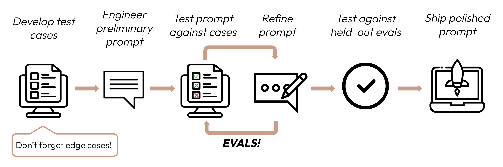

# Day 8
AI prompt engineering is the art of creating and enhancing the input texts (prompts) to guide generative AI models toward producing the relevant outputs. It involves iterative trial-and-error to maximize model performance for specific 

The above image says the prompt life cyle --> Develop test cases ->  Engineer Preliminary prompt -> Test prompt again test case ->Refine prompt (loop this process till the expected results are achieved) -> deploy the prompty

Clean and direct prompts :
1. LLM responds and act very well for the clear and explicit prompt. Be specific about your output so that, it'll perform better. 
2. Golden rule: Show your prompt to a colleague with minimal context on the task and ask them to follow it. If they'd be confused, LLM will be too.
3. Be specific about the desired output format and constraints, Provide instructions as sequential steps using numbered lists or bullet points when the order or completeness of steps matters.
4. Examples are one of the most reliable ways to steer Claude's output format, tone, and structure. A few well-crafted examples (known as few-shot or multishot prompting) can dramatically improve accuracy and consistency. We can use the <Example></Example> XML tag for making more explicit

## Learning from the code
The complaints which we had more than one problem but which is the primary cause for the problem to write the comment in such a way and which department needs to act accordingly.
|Model | Zero shot accuracy|Few shot accuracy|Remarks|
|:-------------:|:------------------:|:------------------:|:--:|
|BART	        |      5/5           |	     5/5	      | This has encoder which is making to correctly identify the correct labels|
|DISTILLBERT	|      3/5	         |       3/5          | This is slightly getting confused with the similar labels such as return/ refund with payment issue might be we have to give selected labels using top_k methods which might be relevant to the problem (This top_k can be taken from other model result which might be correct label using that it will make it better i guess)|
|QWEN	        |      1/5	         |       4/5          |	This has really taken the context in the prompt into consideration, so it made jump from 20% to 80%. Also here we are using another model to give the relevant example instead of blindly giving the model all the examples into the single prompt. Also we are using the XML tag which makes it easier for the model to use it to understand what is happening in the model|

# Day 9
The Chain of thought is nothing asking the LLM to think before responding. This way we will start using the LLM's reasoning capabilities which reduces the manual efforts of looping by making it to think step by step. It is a technique that improves AI reasoning by encouraging the model to generate the intermediate steps before producing the final answers.
Main advantage I am seeing here is that the transparency on how the LLM thinks which makes it easier for us to debug

### Some of the prompting techniques are
1. **Zero shot** --> The model uses its pre-trained knowledge to directly answer the task.
2. **Few Shot** --> Provide some example and ask that model to answer it accordingly
3. **Zero shot + Chain of thoughts** --> Asking the model to think before answering without giving any example or context
4. **Few shot + Chain of thoughts** -->  Providing some relevant example and the reasoning behind which helps the model to think better
5. **Automate Chain of thoughts** --> This is kind of the free flow without any structure and then try to answer the question
6. **Automate Chain of thoughts + Self Consistency** --> This is also similar to the Auto COT but here the voting process will happen to decide which output is correct
7. **Tree of Thoughts** --> This is very structed way to think different path and choose the answer arbitrarily
8. **Tree of Thoughts + Self Consistency** --> This is very structed way to think different path and choose the answer based on the voting and then produce the final output
9. **Meta Prompting** --> First plan then Execute 

| Technique      | Key Idea                    | Example (Same Problem)                                                    |
| -------------: | :-------------------------: | :------------------------------------------------------------------------ |
| Zero-shot      | No examples                 | Directly answer → **“payment issue”**                                     |
| Few-shot       | Learn from examples         | See similar example → then answer **“payment issue”**                     |
| Zero-shot CoT  | Force reasoning             | “Step 1: payment failed → Step 2: money deducted → Answer: payment issue” |
| Few-shot CoT   | Teach reasoning             | Example shows reasoning → model copies → **“payment issue”**              |
| Auto-CoT       | Model creates reasoning     | “Let’s think… maybe billing or payment… → payment issue”                  |
| Auto-CoT + SC  | Multiple reasoning + voting | 5 runs → 3 say payment → final = **payment issue**                        |
| ToT            | Explore multiple paths      | Path 1: payment flow → Path 2: billing → Path 3: system → choose best     |
| ToT + SC       | Paths + best selection      | Multiple paths + voting → **payment issue**                               |
| Meta Prompting | Plan before solving         | “Step 1: decide approach → classification → reasoning → answer”           |

### One liner for remembering the points

Zero → Answer  
Few → Learn 
CoT → Think 
Auto-CoT → Think freely 
SC → Vote 
ToT → Explore 
Meta → Plan 

### when to use this models

| Situation             | Best Technique     |
| --------------------- | ------------------ |
| Simple task           | Zero-shot          |
| Pattern-based         | Few-shot           |
| Needs reasoning       | CoT                |
| No examples available | Auto-CoT           |
| Unstable outputs      | + Self-Consistency |
| Complex problems      | ToT                |
| Dynamic tasks         | Meta Prompting     |

### how hallucination will also work on this 
| Technique      | Hallucination Risk | Why                                               |
| -------------- | ------------------ | ------------------------------------------------- |
| Zero-shot      | 🔴 High            | No guidance, direct guessing                      |
| Few-shot       | 🟡 Medium          | Anchored by examples but limited                  |
| Zero-shot CoT  | 🟡 Medium          | Structured thinking helps but no grounding        |
| Few-shot CoT   | 🟢 Low             | Guided reasoning + examples                       |
| Auto-CoT       | 🔴 High            | Model invents reasoning freely                    |
| Auto-CoT + SC  | 🟡 Medium          | Voting reduces randomness but not bias            |
| ToT            | 🔴 High            | Explores many paths → more chances of wrong logic |
| ToT + SC       | 🟡 Medium-Low      | Voting stabilizes multiple paths                  |
| Meta Prompting | 🟡 Medium          | Better planning but still model-dependent         |

No Guidance → Guessing → High Hallucination  
Guidance → Reasoning → Medium  
Guidance + Validation → Low  

High  → Zero-shot, Auto-CoT, ToT  
Medium → Few-shot, Zero-shot CoT, Auto-CoT + SC, Meta  
Low → Few-shot CoT, ToT + SC  

