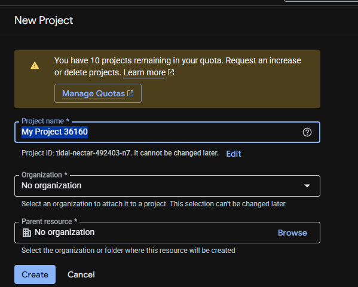
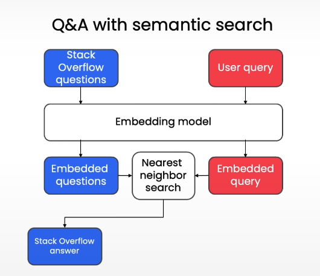

# Day 15 Understanding and Applying Text Embeddings

### how to create a account in the Google cloud


google cloud console creation link for your reference created by Deep learning ai: https://learn.deeplearning.ai/courses/google-cloud-vertex-ai/lesson/vaq9c/optional---google-cloud-setup<br>
Course: https://learn.deeplearning.ai/courses/google-cloud-vertex-ai/lesson/nswu9/getting-started-with-text-embeddings <br>
Google Cloud Project: https://console.cloud.google.com/projectcreate<br>
Vertex AI API: https://console.cloud.google.com/apis/api/aiplatform.googleapis.com/metrics<br>
Billing: https://console.cloud.google.com/billing<br>
Service Accounts: https://console.cloud.google.com/iam-admin/serviceaccounts<br>
---------------------------------------------------------------------
##  Important Notes
1. It is recommended to use a fresh Gmail account.
2. Google Cloud typically provides $300 free credits.
3. Recently, Google may require a minimum payment (~₹1000) to activate billing.
4. Ensure billing is enabled, otherwise APIs won’t work.

-----------------------------------------------------------------------
## Step 1: Create a New Project
Go to the Google Cloud Console:
👉 https://console.cloud.google.com/projectcreate

1. Click Create Project
2. Select "No Organization" (for personal use)
3. Google may auto-create an organization based on your email



-----------------------------------------------------------------------
## Step 2: Select Your Project
Once created:
Your project name will appear at the top-left corner <br>
Make sure it is selected before proceeding


-----------------------------------------------------------------------
## Step 3: Enable Billing
Click on the ☰ (hamburger menu) → Go to Billing <br>
Link your billing account to the project

If successful, it should look like:


-----------------------------------------------------------------------
## Step 4: Create a Service Account
Go to ☰ Menu → IAM & Admin → Service Accounts <br>
Click Create Service Account


-----------------------------------------------------------------------
## Step 5: Assign Permissions (Very Important)
While creating the service account, assign the following roles:

1. Vertex AI Administrator
2. BigQuery Admin

⚠️ These roles are mandatory to use Vertex AI and embeddings properly.


-----------------------------------------------------------------------
## Step 6: Generate Service Account Key

### After creating the service account:

1. Click the 3 dots (⋮) on the right side
2. Select Manage Keys
3. Click Add Key → Create New Key
4. Choose JSON format
5. Download and store the file securely


## Text Embedding

Embedding is nothing but the way of representing the data as a points in space where the location is semantically meaningful

In the week 1 when we are reading the word2vec where the text embedding have been happened where the sentence each word/ token got converted to the embedding of that sentence and then the mean of it has been taken in order to find the final embedding but after attention it got different 

when I am trying it now with the vertexai how this is working

***Python code***

```
sent1 = "The Kids are playing in the park area"
sent2 = "The playing area in the park are for kids "
sent1_imp_word_arr = ["Kids", "playing", "park", "area"]
sent2_imp_word_arr = ["playing", "area", "park", "Kids"] 

emb_imp1 = [emb.values for emb in embedding_model.get_embeddings(sent1_imp_word_arr)]
emb_imp1_arr = np.stack(emb_imp1)
emb_imp2 = [emb.values for emb in embedding_model.get_embeddings(sent2_imp_word_arr)]
emb_imp2_arr = np.stack(emb_imp2)
emb_imp1_mean = emb_imp1_arr.mean(axis=0)
emb_imp2_mean = emb_imp2_arr.mean(axis=0)
print(f"cosine_similarity([emb_imp1_mean], [emb_imp2_mean]): {cosine_similarity([emb_imp1_mean], [emb_imp2_mean])}")
```
The output of the cosine similarity of the **important words in the sentence is 1** though the meaning are different
but **when I ran the below code it gave the result as 95% where sentence embedding is being done**

```
emb_sent1 = embedding_model.get_embeddings([sent1])[0].values  
emb_sent2 = embedding_model.get_embeddings([sent2])[0].values
emb_sent1[:10 ], emb_sent2[:10]
print(f"cosine_similarity([emb_sent1], [emb_sent2]): {cosine_similarity([emb_sent1], [emb_sent2])}")
```

Recent changes in the sentence embeddings are context awareness where each word is aware of the what meaning it is trying to bring it into the sentence (Q, K, V based on that Query: what am i looking for
Key: what I offer (Summary version, like a lable)
Value: what actually i have
)
Computing embeddings for each token(sub words) which even helps to similar embedding for the misspelled words in the sentence because of the context awareness


How to train this sentence transformers is by providing the similar sentence and tune the neural network to give the embedding more similar and vice versa with the dissimilar


### Applications of text embeddings are:
1. Classification
2. Clustering
3. Outlier Detection
4. Semantic search
5. Recommendation

## Visualisation 
This is purely used in the visualisation not for comparing to emebedding
1. Using the PCA and reducing the number of vectors
2. Using the heatmap and trying to understand the commanality between words

This is not visualisation but you can use the cosine similarity to find the distance between the vectors


### PCA
```
sent_v1 = "There are lot of animals in the zoo"
sent_v2 = "Each animal in the zoo has a different story to tell"
sent_v3 = "In forest you can find many animals true nature"
sent_v4 = "The Forest is the place where you can find the different plant species"
sent_v5 = "There are a lot people work in the office"
sent_v6 = "office is the place where people work and do their job"
sentences = [sent_v1, sent_v2, sent_v3, sent_v4, sent_v5, sent_v6]
embeddings = [embedding_model.get_embeddings([sent])[0].values for sent in sentences]
embeddings_arr = np.stack(embeddings)
pca = PCA(n_components=2)
embeddings_2d = pca.fit_transform(embeddings_arr)
plt.figure(figsize=(10, 6))
plt.scatter(embeddings_2d[:, 0], embeddings_2d[:, 1])
for i, sent in enumerate(sentences):
    plt.annotate(f"sent_{i+1}", (embeddings_2d[i, 0], embeddings_2d[i, 1]))
plt.show()
```


### Heat Map
```
from itertools import combinations

for i, j in combinations(range(len(sentences)), 2):
    sim = cosine_similarity([embeddings_arr[i]], [embeddings_arr[j]])[0][0]
    print(f"Cosine similarity between sent_{i+1} and sent_{j+1}: {sim * 100:.2f}%")
```

## Application where it can be useful

1. Clustering of text
2. Classification of text
3. Outlier Detection
4. Semantic search 


***1. Clustering of text Code:***

In this use case what we tried to do is that we tried to take the stack overflow question and tried to do the Kmeans algo on top of it to identify whether which coding language related to question. 
In this there were two coding language was taken into consideration

```
n_clusters = 2
kmeans = KMeans(n_clusters=n_clusters, 
                random_state=0, 
                n_init = 'auto').fit(clustering_dataset)
PCA_model = PCA(n_components=2)
PCA_model.fit(clustering_dataset)
new_values = PCA_model.transform(clustering_dataset)
plt.figure(figsize=(10, 6))
plt.scatter(new_values[:, 0], new_values[:, 1], c=kmeans_labels, cmap='viridis', label=kmeans_labels)
plt.title('KMeans Clustering of Question Embeddings')
plt.show()
```

------------------------------------------------------------------------------------------
***2. Classifcation of text Code:***

This is supervised learning method where we will train the model to predict correct label for the text. 
I tried it with Stack overflow data and got the output to be with the accuracy of 68% without any hyper parameter tuning, the model which i had used was Randomforestclassifier.

```
X_train, X_test, y_train, y_test = train_test_split(X, 
                                                    y, 
                                                    test_size = 0.2, 
                                                    random_state = 2)
clf = RandomForestClassifier(n_estimators=200)
clf.fit(X_train, y_train)
y_pred = clf.predict(X_test)
accuracy = accuracy_score(y_test, y_pred) # compute accuracy
print("Accuracy:", accuracy)
```

------------------------------------------------------------------------------------------
***3. Outlier Detection:***

I used a library know as isolation forest
- `IsolationForest` classifier will predict `-1` for potential outliers, and `1` for non-outliers.

```
clf = IsolationForest(contamination=0.005, 
                      random_state = 2) 
y_pred = clf.fit_predict(question_embeddings)
so_df[y_pred==-1]
```

------------------------------------------------------------------------------------------

***4. Semantic Search:***

*Grounding LLM:*
- Accessing the information from the outside of the trainig data
- Integrate it with the existing database and trying to produce the result
- This will reduce the hallucination

Lastime for the few shot prompting i have used the semantic search we have used the mini LM using the cosine similarity
in this we are trying to similar thing.



In this course I have learnt different types of the semantic search algo I have learnt those are 
 - `Scann` --> It is a high perfroming  vector search. It uses 3 technique those are partitioning, Scoring, Rescouring. It is mainly used in the place where there are lot of data is there like billions of data and retrieve it efficiently
        a. Partitioning --> during the building it will partition the data into smaller partition and it will search only those partition
        b. Scoring mechanism --> Anisotropic vector quantisation compresses the vector while preserving the data vector and gives the correct direction
        c. Rescoring mechanism --> This is optionally after finding the final compressed vector it will uncompress the vector and find the final answer.

    I was not able to use run it in my local system but understood the concept
    below is the sample code which I got from Internet

    `Code:`
    ```
    index = scann.scann_ops_pybind.builder(
        question_embeddings,
        num_neighbors=10,
        distance_measure="dot_product"
    ).tree(
        num_leaves=25,
        num_leaves_to_search=10,
        training_sample_size=2000
    ).build()
    query_embedding = embedding_model.get_embeddings([query])[0].values
    neighbors, distances = index.search(query_embedding, final_num_neighbors = 1)

    ```
- `Brute Force` --> Using the embedding + Cosine similarity we can search a document this code I have taken from the week 2 prompting excercise

    `Code:`
    ```
        def few_shot_examples_identifier(query, top_k=3, threshold = 0.5):
        query_embedding = embedder.encode(query, convert_to_tensor=True, normalize_embeddings=True)
        cosine_scores = util.cos_sim(query_embedding, example_embeddings)[0]
        cosine_scores_numpy = cosine_scores.cpu().numpy()  # Move to CPU and convert to numpy
        # scored_examples = [(ex, score) for ex, score in zip(few_shot_examples, cosine_scores_numpy) if score >= threshold]
        scored_examples = []
        for i, (ex, score) in enumerate(zip(few_shot_examples, cosine_scores_numpy)):
            # print(f"Example {i+1}: '{ex[0]}' (Category: {ex[1]}) - Cosine Similarity: {score:.4f}")
            if score >= threshold:
                scored_examples.append((ex, score))
        scored_examples.sort(key=lambda x: x[1], reverse=True)  # Sort by similarity score
        #fallback option if no examples meet the threshold
        if len(scored_examples) == 0:
            arr_position = cosine_scores_numpy.argmax()
            scored_examples.append((few_shot_examples[arr_position], cosine_scores_numpy[arr_position]))
        return scored_examples[:top_k]
    ```
- `Faiss CPU`<br>
        a. Refers to FAISS running on CPU<br>
        b. Supports both exact and approximate search<br>
        c. Accuracy depends on index type (Flat, IVF, HNSW), not CPU<br>
        

    `Flat search Code`
    ```
    embeddings = np.array(question_embeddings, dtype=np.float32, order='C')
    faiss.normalize_L2(embeddings)
    dim = embeddings.shape[1]

    index = faiss.IndexFlatIP(dim)
    index.add(embeddings)
    query_embedding = np.array(
    embedding_model.get_embeddings([query])[0].values).astype("float32").reshape(1, -1)

    faiss.normalize_L2(query_embedding)
    D, I = index.search(query_embedding, k=1)
    neighbors = I[0]
    distances = D[0]
    print(neighbors, distances)
    ```
    `IVF search:`

    ```
    nlist = 25   # ≈ num_leaves

    quantizer = faiss.IndexFlatIP(dim)
    index_ivf = faiss.IndexIVFFlat(quantizer, dim, nlist)

    index_ivf.train(embeddings)

    index_ivf.add(embeddings)

    query_embedding = np.array(
        embedding_model.get_embeddings([query])[0].values
    ).astype("float32").reshape(1, -1)

    faiss.normalize_L2(query_embedding)

    index_ivf.nprobe = 10   # ≈ num_leaves_to_search

    D, I = index_ivf.search(query_embedding, k=1)

    neighbors = I[0]
    distances = D[0]

    print(neighbors, distances)
    ```